# 软件架构 核心技术语定义

版本：V1.0

2026-04-30

东软集团股份有限公司 产品创新与软件资产管理部

(版权所有，翻版必究)

## 文件修改控制

<table border=1 style='margin: auto; word-wrap: break-word;'><tr><td style='text-align: center; word-wrap: break-word;'>修改编号</td><td style='text-align: center; word-wrap: break-word;'>版本</td><td style='text-align: center; word-wrap: break-word;'>修改条款及内容</td><td style='text-align: center; word-wrap: break-word;'>修改日期</td></tr><tr><td style='text-align: center; word-wrap: break-word;'>1</td><td style='text-align: center; word-wrap: break-word;'>V1.0</td><td style='text-align: center; word-wrap: break-word;'>创建</td><td style='text-align: center; word-wrap: break-word;'>2026-04-30</td></tr><tr><td style='text-align: center; word-wrap: break-word;'></td><td style='text-align: center; word-wrap: break-word;'></td><td style='text-align: center; word-wrap: break-word;'></td><td style='text-align: center; word-wrap: break-word;'></td></tr><tr><td style='text-align: center; word-wrap: break-word;'></td><td style='text-align: center; word-wrap: break-word;'></td><td style='text-align: center; word-wrap: break-word;'></td><td style='text-align: center; word-wrap: break-word;'></td></tr><tr><td style='text-align: center; word-wrap: break-word;'></td><td style='text-align: center; word-wrap: break-word;'></td><td style='text-align: center; word-wrap: break-word;'></td><td style='text-align: center; word-wrap: break-word;'></td></tr><tr><td style='text-align: center; word-wrap: break-word;'></td><td style='text-align: center; word-wrap: break-word;'></td><td style='text-align: center; word-wrap: break-word;'></td><td style='text-align: center; word-wrap: break-word;'></td></tr></table>

## 目录

1. 文档目的与适用范围 ..... 4  
1.1 文档目的 ..... 4  
1.2 适用范围 ..... 5  
1.3 适用对象 ..... 5  
1.4 使用原则 ..... 5  
2. 术语管理原则 ..... 6  
2.1 术语使用要求 ..... 8  
3. 术语定义 ..... 8  
3.1 基础通用术语 ..... 8  
软件资产 ..... 8  
软件资产的复用 ..... 8  
软件产品 ..... 9  
软件解决方案 ..... 9  
3.2 架构设计 ..... 9  
架构 Architecture ..... 9  
架构拆分 Architecture Partitioning ..... 9  
模块 Building Block ..... 10  
战略架构 Strategic Architecture ..... 10  
分段架构 Segment Architecture ..... 10  
能力架构 Capability Architecture ..... 11  
逻辑架构 Logical Architecture ..... 11  
物理架构 Physical Architecture ..... 11  
基线架构 Baseline Architecture ..... 11  
目标架构 Target Architecture ..... 11  
基础架构 Foundation Architectures ..... 12

通用级架构 Common Systems Architectures.....12    
行业级架构 Industry Architectures.....12    
组织级架构 Organization-Specific Architectures.....12    
3.3 业务架构 BUSINESS ARCHITECTURE.....12    
价值流 Value Stream.....13    
价值主张 Value Proposition.....14    
价值项 Value Item.....14    
价值流阶段 Value Stream Stage.....14    
业务流程 Business Process.....14    
活动 Activity.....14    
业务能力 Business Capability.....14    
能力实例 Capability Instance.....15    
能力行为 Capability Behavior.....15    
业务对象 Business Object.....15    
信息概念 Information Concept.....15    
组织 Organization.....16    
业务单元 Business Unit.....16    
3.4 应用架构 APPLICATION ARCHITECTURE.....17    
系统 System (系统级软件模块).....17    
应用 Application (应用级软件模块).....17    
组件 Component (组件级软件模块).....17    
3.5 数据架构 DATA ARCHITECTURE.....18    
数据实体 Data Entity.....18    
数据产品 Data Product.....18    
数据平台 Data Platform.....18    
3.6 技术架构 TECHNOLOGY ARCHITECTURE.....19    
技术服务 Technology Service.....19    
技术组件 Technology Component.....19

技术平台 Technology Platform ..... 20  
3.7 设计与交付术语 ..... 20  
需求 Requirements ..... 20  
机会及解决方案 Opportunities and Solutions ..... 20  
4. 核心术语之间的关系 ..... 20  
4.1 业务架构 & 应用架构 & 数据架构 & 技术架构 ..... 20  
4.2 业务架构 & 运营模式 ..... 21  
4.3 生产力度量框架 & 架构设计术语 映射 ..... 21  
4.4 C4 & 架构设计术语 映射 ..... 22  
5. 易混淆术语对照 ..... 22  
5.1 软件资产 vs 产品和解决方案 ..... 22  
5.2 业务 vs 需求 vs 项目 ..... 22  
5.3 业务能力 vs 功能 ..... 23  
5.4 价值流 vs 业务流程 vs 业务场景 ..... 23  
5.5 领域 vs 子域 vs 限界上下文 ..... 24  
5.6 信息概念 vs 业务对象 vs 数据实体 ..... 25  
5.7 构块 vs 系统 vs 应用 vs 模块 vs 组件 ..... 26  
5.8 数据架构 vs 数据模型 ..... 27  
5.9 概念模型 vs 逻辑模型 vs 物理模型 ..... 27  
5.10 主数据 vs 基础数据 vs 参考数据 ..... 28  
6. 参考依据 ..... 29

### 1. 文档目的与适用范围

### 1.1 文档目的

为统一软件架构设计过程中相关术语的理解与使用，规范架构表达口径，减少跨团队、跨角色、跨阶段沟通中的语义偏差，特制定本术语定义文档。

本文件旨在实现以下目标：

### 1. 统一术语语义

对软件架构设计、分析、评审、交付和治理过程中常用术语进行统一定义，形成组织内一致的语言基础。

### 2. 规范架构表达

为架构文档编写、架构图绘制、方案汇报、设计评审和技术沟通提供统一术语标准，提升表达准确性与专业性。

### 3. 支撑设计协同

促进业务、产品、架构、研发、测试、运维及治理等不同角色在架构设计活动中的认知一致，降低沟通成本，提高协作效率。

### 4. 支撑治理落地

为架构设计规范、评审标准、交付要求和能力建设提供基础术语支撑，增强架构治理工作的可执行性和可复用性。

### 5. 沉淀组织知识资产

将架构设计中的关键概念、术语边界和使用规范沉淀为组织级知识资产，为后续培训推广、经验复盘和方法演进提供支撑。

### 1.2 适用范围

本文件适用于公司软件系统在架构设计、技术方案设计、系统建设和架构治理活动中涉及的术语定义、使用与管理。

适用范围包括但不限于以下场景：

架构设计文档编写

架构评审与技术评审

解决方案设计与汇报

系统建模与架构图绘制

项目立项、方案论证与实施交付

架构治理、规范建设与能力推广

培训宣贯与知识传承

### 1.3 适用对象

本文件适用于参与软件架构相关工作的各类角色，包括但不限于：

企业架构师、业务架构师、应用架构师、数据架构师、技术架构师

项目经理、产品经理、业务分析人员

开发工程师、测试工程师、运维工程师

技术负责人、研发经理、架构治理人员

其他参与系统规划、设计、建设和治理的相关人员

### 1.4 使用原则

本文件作为组织内软件架构术语使用的基础依据，在相关设计、评审和交付活动中应遵循以下原则：

正式文档、正式评审和正式沟通场景中，应优先使用本文件定义的标准术语。

对于本文件已定义术语，不应随意改变其含义或以其他近义词替代。

对于项目特有术语，可在项目文档中补充定义，但不得与本文件既有定义冲突。

对于本文件尚未覆盖的新术语，应按统一机制提出补充和审定申请后纳入管理。

### 2. 术语管理原则

为保证术语定义的准确性、一致性、可理解性和可维护性，软件架构术语的制定、使用和维护应遵循以下原则。

### 1. 统一性原则

术语应在组织范围内保持统一命名、统一定义、统一使用口径。

同一概念原则上应对应同一术语，不同文档、不同团队、不同项目之间不应对同一术语赋予不同含义。

### 2. 准确性原则

术语定义应准确反映其本质含义、应用边界和专业语境，避免表述模糊、范围失真或概念混淆。

### 3. 简洁性原则

定义中应突出术语的核心特征，必要时明确其“不是什么”，以避免误用。

术语定义应在保证准确性的前提下，尽量简明、清晰、可读，避免过度展开、循环定义或使用新的未定义术语解释旧术语。

原则上应做到“定义简洁、边界明确、便于理解”。

### 4. 一词一义原则

同一术语在同一管理体系下应尽量保持单一明确含义，不宜一词多义。

如同一词在不同上下文中确有不同含义，应明确区分其适用语境，并分别说明。

对于同一概念，应优先选用一个标准术语进行表达，避免多个近义词混用。

对于历史上已存在的别名、俗称、口语化表达，可作为“别名”或“常见误用”进行说明，但不作为正式术语使用。

### 5. 分层分类原则

术语应结合架构设计实际需要，按照基础通用、业务架构、应用架构、数据架构、技术架构、设计与交付等类别进行分类管理。

术语分类应体现其主要语义归属，必要时可通过“相关术语”或“交叉引用”说明其跨类别关联。

### 6. 场景化原则

术语定义不仅应说明概念本身，还应尽可能说明其适用场景、使用语境和实践边界。

对于容易在业务分析、系统设计、数据设计、技术实现等不同场景下产生歧义的术语，应特别说明其适用上下文。

### 7. 规范性原则

术语命名与表述应尽量符合公司既有规范、行业通行认知及成熟方法体系，必要时参考相关标准、框架与方法论。

正式术语应包含规范中文名称；如存在稳定的英文名称或缩写，也应同步给出。

### 8. 可追溯原则

术语的新增、修订、废弃应具备明确依据和版本记录。

对于重要术语，应能够追溯其来源、变更原因、审批过程及适用版本，以确保术语管理过程可审计、可维护。

### 9. 演进性原则

术语体系应随着组织实践、架构方法、技术演进和治理要求的变化持续完善。

对于新出现的重要概念、组织内高频使用但尚未标准化的术语，应及时纳入统一治理范围；对于已不适用或存在明显歧义的术语，应及时修订或废弃。

### 2.1 术语使用要求

在使用过程中，应遵循以下要求：

1．在正式文档中首次出现术语时，宜给出中文全称，必要时补充英文名称和缩写。

2．架构图、说明文字、表格、评审材料中的术语应保持前后一致。

3．不应在同一份文档中混用多个含义相近但边界不同的术语。

4．对本文件未定义但项目必须使用的术语，应在项目范围内进行补充定义并注明来源。

5．对歧义较高或易误解的术语，宜补充示例、反例或对比说明。

### 3. 术语定义

### 3.1 基础通用术语

## 软件资产

组织拥有或有权使用的，以物理形态存在的软件资源。软件资产从物理形态上分为系统、应用和组件，在软件架构设计领域可以称为系统级构块、应用级构块和组件级构块。其中，系统级构块（或系统）应能够支持其所服务或管理对象（如患者、订单、电力用户等）的完整业务生命周期。

## 软件资产的复用

应以软件的使用者（人或其他软件）可以操作的接口（Interface）来评估“软件制品资产”的复用性。如果软件存在人机交互接口（UI），那么应通过 UI 的复用性来评估软件的可复用性。如果软件存在应用程序接口（API），那么应通过 API 来评估软件的可复用性。通过源代码进行修改的复用方式不能称之为软件的复用。注意，有些编程语言，比如 GO 语言的 Package，RUST 语言的 Crate，虽然不能像 Java 那样以编译后的软件制品方式提供“组件库”的复用，但须以接口的方式使用打包好“组件库”的源代码才能称之为组件的复用。

## 软件产品

销售给客户的，能够重复解决多个客户问题的解决方案软件称之为软件产品。

## 软件解决方案

销售给客户的，能够解决特定客户问题的软件称之为软件解决方案。

### 3.2 架构设计

## 架构 Architecture

来源：TOGAF

系统在其所处环境中的基础概念或属性，其内容包括它的元素、关系和它的设计与演进原则。

架构 = 元素 + 关系 + 设计演进原则；而元素及关系与相关原则，表达的目标是领域的相关知识。知识代表的是领域的核心本质，其内容需要通过架构进行结构化的定义与可视化的表达，也即“架构是知识的结构化定义与可视化表达”。

## 架构拆分 Architecture Partitioning

来源：TOGAF

基于关注点分离原则，可将架构从五个维度进行拆分，以拆解与控制复杂性，并实现设计的连续统一：

1．领域：分类为业务架构、应用架构、数据架构、技术架构，架构要实现从业务到 IT 的连续统一。

2．范围：分类为战略架构、分段架构、能力架构，架构要实现从宏观到微观的连续统一。

3．抽象层级：分类为上下文级架构、概念级架构、逻辑级架构、物理级架构，架构要实东软秘密，未经许可不得扩散

现从逻辑到物理的连续统一。

4．状态：分类为基线架构、目标架构，架构要实现从起点状态到目标状态的连续统一。

5．复用度：分类为基础级架构、通用级架构、行业级架构、组织级架构，架构要实现从一般到特殊的连续统一。

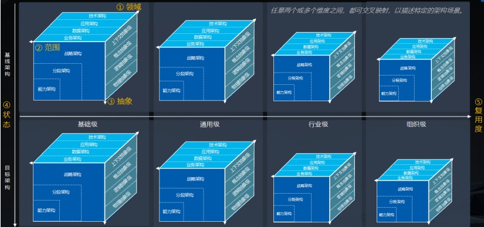

图：架构设计的五个连续统一维度

## 构块 Building Block

构块是架构设计领域中对不同粒度与形态的系统组成元素的逻辑统称。这个统称有利于统一描述架构理论以及高层的项目管理。

## 战略架构 Strategic Architecture

来源：TOGAF

提供企业/业务生态整体的长期架构视图，关注企业范围的战略目标和高层能力。

## 分段架构 Segment Architecture

来源：TOGAF

提供企业特定领域（如人力资源、供应链管理）详细的架构视图。

## 能力架构 Capability Architecture

来源：TOGAF

详细描述特定能力单元，提供当前能力、目标能力及能力增量的视图。

## 逻辑架构 Logical Architecture

来源：TOGAF

1．通过上下文级抽象（Contextual Abstraction Level）定义架构的动机、目标、范围和环境约束，关注 Why-为什么需要架构。

2．通过概念级抽象（Conceptual Abstraction Level），描述高阶行为，不涉及具体的实现，关注 What-具体架构做什么。

3．通过逻辑级抽象（Logical Abstraction Level），识别实现行为所需的组件及组件关系，关注 How-架构如何实现（技术无关）。

以上内容泛化统称为逻辑架构。

## 物理架构 Physical Architecture

来源：TOGAF

物理级抽象（Physical Abstraction Level），描述架构具体使用何种资产实现（如技术产品、基础设施），关注 With What-用什么实现。

## 基线架构 Baseline Architecture

来源：TOGAF

As-Is，提供已定义的现有系统架构状态，作为变更或提升的起点。

## 目标架构 Target Architecture

来源：TOGAF

To-Be，为组织/业务设计的未来架构状态描述，通过弥合与基线架构的差距来实现战略愿景和目标。

## 基础级架构 Foundation Architectures

来源：TOGAF

提供跨行业/技术中立的架构构件，是构建具体架构的基础，包含核心原则、标准和模式等。如基础架构风格/模式（微服务架构模式、事件驱动架构模式等）。

## 通用级架构 Common Systems Architectures

来源：TOGAF

在基础架构之上，描述跨行业通用架构内容，聚焦常见问题为行业级架构提供模板。

## 行业级架构 Industry Architectures

来源：TOGAF

针对特定垂直行业的标准化架构，整合行业最佳实践、合规要求及行业通用流程。

## 组织级架构 Organization-Specific Architectures

来源：TOGAF

定义单个组织独有的架构，解决特定组织战略、流程目标和技术需求。

### 3.3 业务架构 Business Architecture

来源：TOGAF

业务的结构化表达，描述企业如何运用业务关键要素实现组织战略目标。

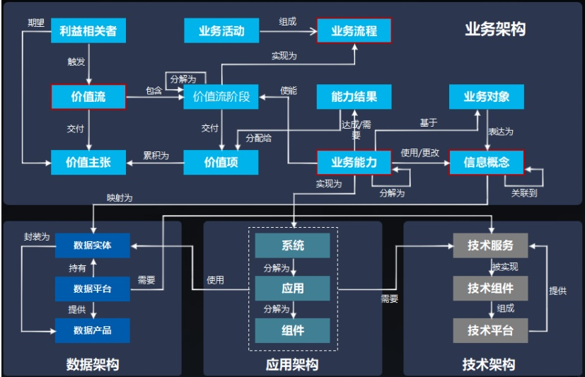

图：架构元模型

## 价值流 Value Stream

来源：BIZBOK

价值流是为客户创造结果的端到端活动集合，即它提供了一个由利益相关者触发的、端到端的描述，说明企业如何为利益相关者提供价值。

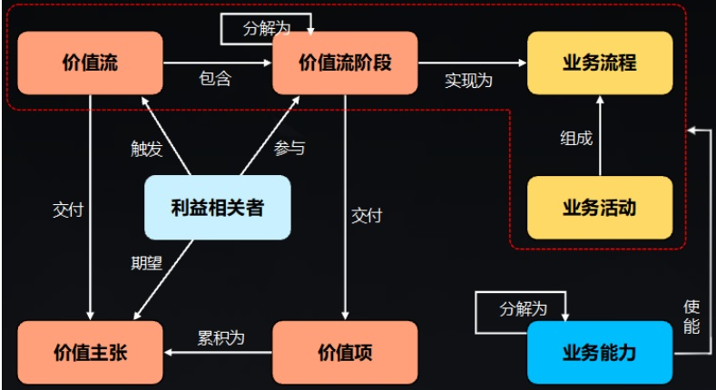

图：价值流与业务流程和业务能力的关系

## 价值主张 Value Proposition

来源：BIZBOK

旨在使公司、产品或服务对客户或相关利益方具有吸引力的创新、服务或功能。

## 价值项 Value Item

来源：BIZBOK

个人或组织对有形或无形物品的价值判断，在与一方或多方的特定互动过程中获得。

## 价值流阶段 Value Stream Stage

来源：BIZBOK

价值流“阶段”代表了价值流从开始到结束过程中与利益相关者的一系列交流。

## 业务流程 Business Process

来源：BIZBOK

业务流程是一组逻辑相关的原子业务活动的组合，旨在完成具体层面的价值项交付实现。

## 活动 Activity

来源：BIZBOK

业务活动是业务流程中的最小工作单元，代表由人或系统执行的、具有明确目标的独立操作单元。

## 业务能力 Business Capability

来源：BIZBOK

业务能力，或简称“能力”，定义了企业的工作内容。业务能力是“企业为实现特定目的或结果而拥有或交换的一种特殊能力”。

东软秘密，未经许可不得扩散

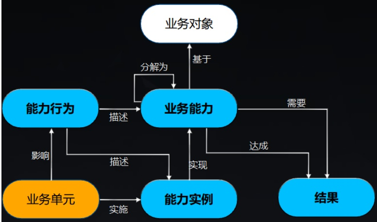

图：业务能力与能力实例和能力行为的关系

## 能力实例 Capability Instance

来源：BIZBOK

一种能力在特定业务单位或其他情境中的具体实现或设想。

## 能力行为 Capability Behavior

来源：BIZBOK

不同业务单位的能力可能具有独特的特征，或以不同的方式表现出来。这些差异在能力图谱中表现为能力行为。“一种能力在某些情况或事例中的行动或行为方式”。

## 业务对象 Business Object

来源：BIZBOK

是业务领域中客观存在的事物（有形，如设备、厂房等）或抽象概念（无形，如品牌、协议等），代表业务运作中需持续关注的核心元素。

## 信息概念 Information Concept

来源：BIZBOK

对业务对象的结构化、显性化的明确表达（Makes explicit），将业务对象的名称、类型、状态、属性及关系转化为可被架构管理的显式概念定义。

信息概念用于表达业务领域知识的抽象概念，其表述的范围大于业务对象，包括：业务对象、描述业务对象状态的概念，和对业务对象的抽象概念，以及业务对象关系/操作的概念等。

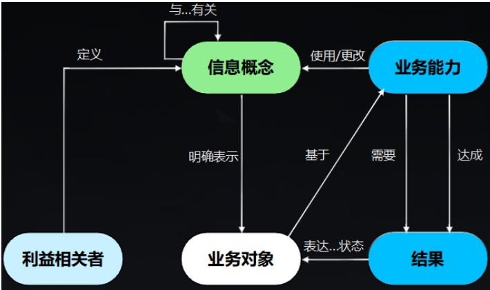

图：信息概念与业务能力和业务对象的关系

## 组织 Organization

来源：BIZBOK

组织是一个由人组成的社会单位，通过系统化的结构和管理来满足需求或持续追求集体目标。组织的这一定义不受公司或法律边界的限制，因此组织映射也同样不受任何限制——除非某个业务架构映射团队选择将组织映射限制在某个子集域内。

## 业务单元 Business Unit

来源：BIZBOK

公司的一个逻辑要素或部分（如会计、生产、营销），代表特定的业务职能，在组织结

构图上有明确的位置，由一名经理负责。也称为部门、分部或职能领域。

### 3.4 应用架构 Application Architecture

来源：TOGAF

描述用于支持业务并对数据进行处理的系统、应用、组件及其关系。

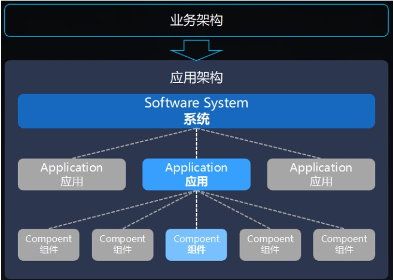

图：应用架构元模型

## 系统 System（系统级软件构块）

最高层次的抽象单元，代表一个完整的、能够独立提供业务能力对应价值交付的软件整体。它由多个应用组成，定义了与外部用户及其他系统的交互边界。

## 应用 Application（应用级软件构块）

系统中可独立部署运行的单元，代表一个应用程序或数据存储。它封装了执行环境或数据，并与其他应用通过网络通信交互。

## 组件 Component（组件级软件构块）

应用内部的构成单元，将相关应用功能基于高内聚进行封装，由一组代码元素（类、函数等）组成，通过接口提供服务。

### 3.5 数据架构 Data Architecture

来源：TOGAF

描述在业务运作和管理中所需要的各类数据信息及关系。

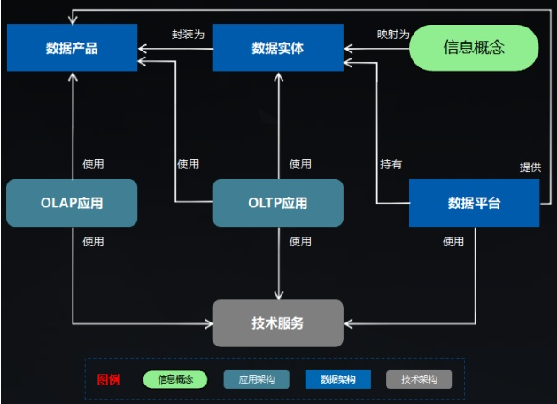

图：数据架构元模型

## 数据实体 Data Entity

是业务概念在数据层面的映射，是构成数据模型的基本单元，是组织收集信息的载体，包括属性、关系及其生命周期状态等。

## 数据产品 Data Product

是指基于数据加工形成的，可满足特定需求的数据加工品，旨在为数据消费者提供高质量、高可用的数据体验。

## 数据平台 Data Platform

是企业数据能力的核心载体，通过组件化供给、平台化管控与生态化连接，实现数据产品和服务的敏捷构建，确保全链路的高效协作。

### 3.6 技术架构 Technology Architecture

来源：TOGAF

描述可以从市场或组织内部获得的，用于支持业务、应用及数据架构部署的软件和硬件资源。

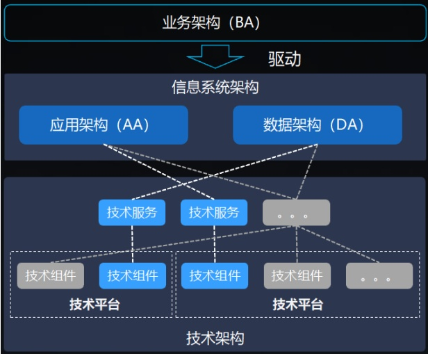

图：技术架构元模型

## 技术服务 Technology Service

技术服务定义了实现应用架构/数据架构设计意图所需的技术能力。作为逻辑模型，它通过分离技术需求与具体实现，保障了架构的稳定性和灵活性。

## 技术组件 Technology Component

技术架构中可部署运行的物理单元，用于实现技术服务，通过架构决策（如技术选型）关联到具体实现。

## 技术平台 Technology Platform

技术平台是由技术组件组合而成并统一进行管理和提供服务的技术基础设施平台，是技术组件的拥有者和技术服务的提供者。

### 3.7 设计与交付术语

## 需求 Requirements

来源：TOGAF

组织（或其利益相关者）为实现业务目标、解决业务痛点、满足合规要求，对企业架构（含业务架构、应用架构、数据架构、技术架构）提出的明确、可验证的期望与要求，是架构开发与治理的核心出发点和最终落脚点。

## 机会及解决方案 Opportunities and Solutions

来源：TOGAF

基于业务架构、应用架构、数据架构、技术架构的现状分析（As-Is）与目标架构（To-Be）的差距，识别架构改进的潜在机会，定义可落地的解决方案，衔接架构设计与实施执行，将架构愿景转化为具体可执行的行动方案，是架构成果落地的关键桥梁。

### 4. 核心技术语之间的关系

### 4.1 业务架构 & 应用架构 & 数据架构 & 技术架构

信息系统架构（应用架构与数据架构）应基于业务价值驱动，信息系统架构也是业务架构的数字化映射；技术架构承接信息系统架构的技术实现及部署的软硬件资源需求。

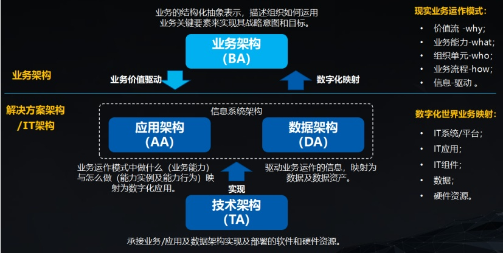

图：4A 架构关系

### 4.2 业务架构 & 运营模式

运营模式补充了业务架构的 How 视角，也解决了战略导向的业务架构如何运营落地的问题。

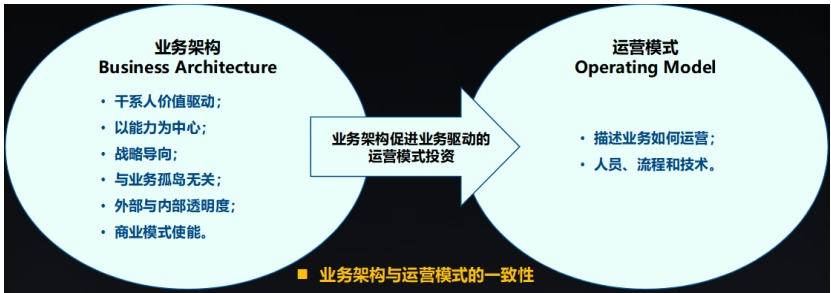

图：业务架构与运营模式的关系

### 4.3 生产力度量框架 & 架构设计术语 映射

<table border=1 style='margin: auto; word-wrap: break-word;'><tr><td style='text-align: center; word-wrap: break-word;'>生产力度量框架</td><td style='text-align: center; word-wrap: break-word;'>架构设计术语</td></tr><tr><td style='text-align: center; word-wrap: break-word;'>业务价值（价）</td><td style='text-align: center; word-wrap: break-word;'>价值流</td></tr></table>

<table border=1 style='margin: auto; word-wrap: break-word;'><tr><td style='text-align: center; word-wrap: break-word;'>业务职责（职）</td><td style='text-align: center; word-wrap: break-word;'>业务能力</td></tr><tr><td style='text-align: center; word-wrap: break-word;'>业务能力（功）</td><td style='text-align: center; word-wrap: break-word;'>能力实例</td></tr></table>

### 4.4 C4 & 架构设计术语 映射

<table border=1 style='margin: auto; word-wrap: break-word;'><tr><td colspan="2">C4</td><td rowspan="2">架构设计术语</td></tr><tr><td style='text-align: center; word-wrap: break-word;'>层级</td><td style='text-align: center; word-wrap: break-word;'>名称</td></tr><tr><td style='text-align: center; word-wrap: break-word;'>Level 1</td><td style='text-align: center; word-wrap: break-word;'>System Context (系统上下文)</td><td style='text-align: center; word-wrap: break-word;'>系统</td></tr><tr><td style='text-align: center; word-wrap: break-word;'>Level 2</td><td style='text-align: center; word-wrap: break-word;'>Container (容器)</td><td style='text-align: center; word-wrap: break-word;'>应用</td></tr><tr><td style='text-align: center; word-wrap: break-word;'>Level 3</td><td style='text-align: center; word-wrap: break-word;'>Component (组件)</td><td style='text-align: center; word-wrap: break-word;'>组件</td></tr><tr><td style='text-align: center; word-wrap: break-word;'>Level 4</td><td style='text-align: center; word-wrap: break-word;'>Code (代码/类)</td><td style='text-align: center; word-wrap: break-word;'></td></tr></table>

### 5. 易混淆术语对照

### 5.1 软件资产 vs 产品和解决方案

软件资产是从生产视角来看一个软件物理形态。解决方案、产品是从销售视角来看一个软件的用途。

无论何种物理形体的软件资产（系统级软件构块、应用级软件构块、组件级软件构块）都可当做解决方案或产品来销售，这是根据市场情况所决定的动态变化的销售行为，至于是否定义为软件解决方案还是软件产品，取决于其可复用程度。

### 5.2 业务 vs 需求 vs 项目

业务是组织为实现经营目标、管理目标或服务目标而开展的价值活动、规则体系与运作机制的总称。

需求是针对某一业务目标、业务问题或使用场景提出的能力诉求、约束条件或改进期望。

项目是为实现特定目标、交付特定成果而在一定时间、资源和约束条件下组织开展的一次性工作。

<table border=1 style='margin: auto; word-wrap: break-word;'><tr><td style='text-align: center; word-wrap: break-word;'>术语</td><td style='text-align: center; word-wrap: break-word;'>定义重点</td><td style='text-align: center; word-wrap: break-word;'>回答的问题</td><td style='text-align: center; word-wrap: break-word;'>典型特征</td></tr><tr><td style='text-align: center; word-wrap: break-word;'>业务</td><td style='text-align: center; word-wrap: break-word;'>组织的价值活动及运作体系</td><td style='text-align: center; word-wrap: break-word;'>做什么、为什么做</td><td style='text-align: center; word-wrap: break-word;'>相对稳定、面向价值</td></tr><tr><td style='text-align: center; word-wrap: break-word;'>需求</td><td style='text-align: center; word-wrap: break-word;'>围绕业务提出的能力诉求或约束</td><td style='text-align: center; word-wrap: break-word;'>需要什么、改什么</td><td style='text-align: center; word-wrap: break-word;'>面向问题与变化</td></tr><tr><td style='text-align: center; word-wrap: break-word;'>项目</td><td style='text-align: center; word-wrap: break-word;'>为实现目标而组织开展的一次性工作</td><td style='text-align: center; word-wrap: break-word;'>如何落地、如何交付</td><td style='text-align: center; word-wrap: break-word;'>有周期、有资源、有交付</td></tr></table>

### 5.3 业务能力 vs 功能

业务能力强调组织“能够做成什么事”，关注的是对业务价值的支撑，而不是具体由谁、通过什么系统、以什么操作步骤实现。

功能是指系统、应用、模块或产品为满足某项需求而提供的具体行为、操作或服务。

功能强调的是“系统具体做什么”，通常是面向用户操作、系统处理或技术实现的具体项。

<table border=1 style='margin: auto; word-wrap: break-word;'><tr><td style='text-align: center; word-wrap: break-word;'>术语</td><td style='text-align: center; word-wrap: break-word;'>定义重点</td><td style='text-align: center; word-wrap: break-word;'>回答的问题</td><td style='text-align: center; word-wrap: break-word;'>稳定性</td><td style='text-align: center; word-wrap: break-word;'>典型特征</td></tr><tr><td style='text-align: center; word-wrap: break-word;'>业务能力</td><td style='text-align: center; word-wrap: break-word;'>组织应具备的业务支撑能力</td><td style='text-align: center; word-wrap: break-word;'>业务上需要具备什么能力</td><td style='text-align: center; word-wrap: break-word;'>较稳定</td><td style='text-align: center; word-wrap: break-word;'>业务架构、能力地图、系统规划</td></tr><tr><td style='text-align: center; word-wrap: break-word;'>功能</td><td style='text-align: center; word-wrap: break-word;'>系统提供的具体行为或服务</td><td style='text-align: center; word-wrap: break-word;'>系统具体做什么</td><td style='text-align: center; word-wrap: break-word;'>相对易变</td><td style='text-align: center; word-wrap: break-word;'>需求分析、产品设计、开发测试</td></tr></table>

### 5.4 价值流 vs 业务流程 vs 业务场景

价值流强调“价值如何产生、如何传递、如何最终被交付”，关注跨环节、跨职能、跨

组织边界的整体价值实现过程，关注的是订单从发起到交付完成的端到端价值交付链路。

业务流程强调“事情按什么步骤做、由谁做、如何流转”，关注业务执行过程中的活动顺序、规则、角色分工和流转逻辑。

业务场景是指在特定条件、特定角色、特定目标和特定上下文下发生的一类典型业务情形。业务场景强调“在什么情况下、由谁、为了什么，会发生什么样的业务交互或业务处理”，关注业务发生的具体语境和典型情形。

<table border=1 style='margin: auto; word-wrap: break-word;'><tr><td style='text-align: center; word-wrap: break-word;'>术语</td><td style='text-align: center; word-wrap: break-word;'>定义重点</td><td style='text-align: center; word-wrap: break-word;'>回答的问题</td><td style='text-align: center; word-wrap: break-word;'>典型粒度</td><td style='text-align: center; word-wrap: break-word;'>典型特征</td></tr><tr><td style='text-align: center; word-wrap: break-word;'>价值流</td><td style='text-align: center; word-wrap: break-word;'>端到端价值交付链路</td><td style='text-align: center; word-wrap: break-word;'>价值如何产生并交付</td><td style='text-align: center; word-wrap: break-word;'>较高层</td><td style='text-align: center; word-wrap: break-word;'>业务架构、能力规划、端到端优化</td></tr><tr><td style='text-align: center; word-wrap: break-word;'>业务流程</td><td style='text-align: center; word-wrap: break-word;'>业务活动的步骤与流转</td><td style='text-align: center; word-wrap: break-word;'>事情按什么顺序做</td><td style='text-align: center; word-wrap: break-word;'>中等粒度</td><td style='text-align: center; word-wrap: break-word;'>流程设计、流程管理、系统承接</td></tr><tr><td style='text-align: center; word-wrap: break-word;'>业务场景</td><td style='text-align: center; word-wrap: break-word;'>特定条件下的业务情形</td><td style='text-align: center; word-wrap: break-word;'>在什么情况下会发生什么</td><td style='text-align: center; word-wrap: break-word;'>较具体</td><td style='text-align: center; word-wrap: break-word;'>需求分析、系统设计、测试设计</td></tr></table>

### 5.5 领域 vs 子域 vs 限界上下文

领域是组织开展业务活动、解决业务问题并创造业务价值所涉及的业务问题空间，用于描述“组织在做什么业务、面对什么业务问题、需要管理什么业务对象和规则”，是从整体上对某类业务范围的抽象。

子域是在某一领域内部，按照业务目标、业务能力、业务职责或问题特征进一步划分形成的较小业务问题空间，用于对复杂领域进行分解，以便更清晰地识别业务重点、职责边界和能力结构。

限界上下文是在特定边界内对某个领域模型、术语语义、业务规则和对象关系进行一致定义和使用的语义边界，用于解决复杂业务中“同一术语在不同语境下含义不同”或“同一

业务对象在不同职责范围内建模方式不同”的问题。

领域回答“业务整体范围是什么”，子域回答“领域内部可分成哪些业务部分”，限界上下文回答“在某个边界内模型如何保持一致”。

<table border=1 style='margin: auto; word-wrap: break-word;'><tr><td style='text-align: center; word-wrap: break-word;'>术语</td><td style='text-align: center; word-wrap: break-word;'>定义重点</td><td style='text-align: center; word-wrap: break-word;'>所属维度</td><td style='text-align: center; word-wrap: break-word;'>回答的问题</td><td style='text-align: center; word-wrap: break-word;'>典型用途</td></tr><tr><td style='text-align: center; word-wrap: break-word;'>领域</td><td style='text-align: center; word-wrap: break-word;'>整体业务问题空间</td><td style='text-align: center; word-wrap: break-word;'>业务问题空间</td><td style='text-align: center; word-wrap: break-word;'>这类业务范围是什么</td><td style='text-align: center; word-wrap: break-word;'>业务分析、业务建模、领域划分</td></tr><tr><td style='text-align: center; word-wrap: break-word;'>子域</td><td style='text-align: center; word-wrap: break-word;'>领域内部的业务细分单元</td><td style='text-align: center; word-wrap: break-word;'>业务问题空间</td><td style='text-align: center; word-wrap: break-word;'>领域内部可分成哪些部分</td><td style='text-align: center; word-wrap: break-word;'>复杂业务分解、能力分析、重点识别</td></tr><tr><td style='text-align: center; word-wrap: break-word;'>限界上下文</td><td style='text-align: center; word-wrap: break-word;'>模型与语义保持一致的边界</td><td style='text-align: center; word-wrap: break-word;'>解决方案/建模边界</td><td style='text-align: center; word-wrap: break-word;'>在哪里保持模型一致</td><td style='text-align: center; word-wrap: break-word;'>DDD建模、系统拆分、团队协作边界</td></tr></table>

### 5.6 信息概念 vs 业务对象 vs 数据实体

信息概念（Information Concept）用于表达业务领域知识的抽象概念，其表述的范围大于业务对象，包括：业务对象、描述业务对象状态的概念，和对业务对象的抽象概念，以及业务对象关系/操作的概念等。

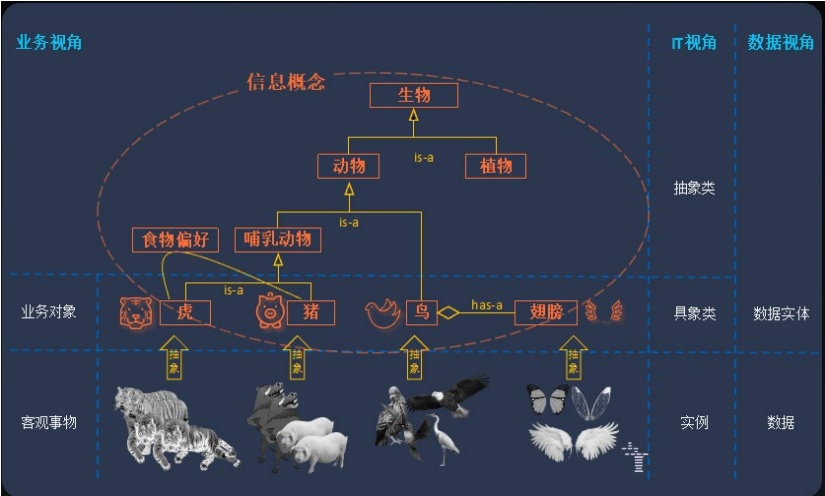

东软秘密，未经许可不得扩散

### 5.7 构块 vs 系统 vs 应用 vs 模块 vs 组件

## 模块（Module）

模块是指系统内部按照一定职责、功能或变化边界划分形成的、具有相对独立性和内聚性的组成单元。

模块通常用于表达系统内部的逻辑分解结果，是系统设计、实现和维护中的常用结构单元。

## 构块（Building Block）

构块通常是指为完成某类架构目标而抽象出来的可组合、可复用的结构性单元。

更强调“构成架构的基本单元”或“用于搭建整体的组成块”，常见于企业架构、方法框架或架构蓝图语境中。

模块强调系统内部的功能/职责划分；构块强调从整体架构视角抽象出的组成单元。

<table border=1 style='margin: auto; word-wrap: break-word;'><tr><td style='text-align: center; word-wrap: break-word;'>术语</td><td style='text-align: center; word-wrap: break-word;'>定义重点</td><td style='text-align: center; word-wrap: break-word;'>主要视角</td><td style='text-align: center; word-wrap: break-word;'>独立运行</td><td style='text-align: center; word-wrap: break-word;'>典型使用场景</td></tr><tr><td style='text-align: center; word-wrap: break-word;'>构块</td><td style='text-align: center; word-wrap: break-word;'>架构层面可组合、可复用的抽象单元</td><td style='text-align: center; word-wrap: break-word;'>架构抽象视角</td><td style='text-align: center; word-wrap: break-word;'></td><td style='text-align: center; word-wrap: break-word;'>企业架构、参考架构、架构蓝图</td></tr><tr><td style='text-align: center; word-wrap: break-word;'>系统</td><td style='text-align: center; word-wrap: break-word;'>面向业务目标的完整运行单元</td><td style='text-align: center; word-wrap: break-word;'>业务支撑 / 治理视角</td><td style='text-align: center; word-wrap: break-word;'>是</td><td style='text-align: center; word-wrap: break-word;'>应用架构、应用建设、运维管理</td></tr><tr><td style='text-align: center; word-wrap: break-word;'>应用</td><td style='text-align: center; word-wrap: break-word;'>面向场景的软件实现载体</td><td style='text-align: center; word-wrap: break-word;'>应用实现 / 运行视角</td><td style='text-align: center; word-wrap: break-word;'>是</td><td style='text-align: center; word-wrap: break-word;'>应用架构、应用建设、运维管理</td></tr><tr><td style='text-align: center; word-wrap: break-word;'>模块</td><td style='text-align: center; word-wrap: break-word;'>系统或应用内部职责划分单元</td><td style='text-align: center; word-wrap: break-word;'>逻辑设计视角</td><td style='text-align: center; word-wrap: break-word;'>否</td><td style='text-align: center; word-wrap: break-word;'>结构设计、职责拆分、代码组织</td></tr></table>

<table border=1 style='margin: auto; word-wrap: break-word;'><tr><td style='text-align: center; word-wrap: break-word;'>组件</td><td style='text-align: center; word-wrap: break-word;'>可装配、可替换、可复用实现\n单元</td><td style='text-align: center; word-wrap: break-word;'>技术实现视角</td><td style='text-align: center; word-wrap: break-word;'>视情况而定</td><td style='text-align: center; word-wrap: break-word;'>技术设计、复用开发、\n装配实现</td></tr></table>

### 5.8 数据架构 vs 数据模型

数据架构是指从整体视角对组织或系统中的数据资产、数据对象、数据关系、数据流转、数据分布、数据共享和数据治理要求所进行的结构化规划与设计，关注“数据整体如何组织、如何流动、如何管理、如何支撑业务与系统运行”。

数据模型是对某一范围内数据对象、属性、关系及约束规则的结构化描述，关注“某类数据具体长什么样、由哪些字段构成、对象之间是什么关系、遵循什么约束”。

数据架构强调组织或系统层面的数据整体规划与结构设计；数据模型强调具体数据对象、关系和结构的建模表达。

<table border=1 style='margin: auto; word-wrap: break-word;'><tr><td style='text-align: center; word-wrap: break-word;'>术语</td><td style='text-align: center; word-wrap: break-word;'>定义重点</td><td style='text-align: center; word-wrap: break-word;'>所处层级</td><td style='text-align: center; word-wrap: break-word;'>回答的问题</td><td style='text-align: center; word-wrap: break-word;'>典型产出</td></tr><tr><td style='text-align: center; word-wrap: break-word;'>数据架构</td><td style='text-align: center; word-wrap: break-word;'>数据整体规划与组织关系</td><td style='text-align: center; word-wrap: break-word;'>全局/架构层</td><td style='text-align: center; word-wrap: break-word;'>数据整体如何组织、流转、共享和治理</td><td style='text-align: center; word-wrap: break-word;'>数据主题域、数据流图、数据分布图、数据治理设计</td></tr><tr><td style='text-align: center; word-wrap: break-word;'>数据模型</td><td style='text-align: center; word-wrap: break-word;'>数据对象及其结构关系定义</td><td style='text-align: center; word-wrap: break-word;'>局部/建模层</td><td style='text-align: center; word-wrap: break-word;'>数据对象有哪些属性、关系和约束</td><td style='text-align: center; word-wrap: break-word;'>ER 图、逻辑模型、物理模型、表结构定义</td></tr></table>

### 5.9 概念模型 vs 逻辑模型 vs 物理模型

概念模型是从业务视角对问题域中的核心对象、主要概念及其关系所做的高层抽象描述，关注“业务里有哪些核心概念，它们彼此是什么关系”，强调业务语义表达，不关注具体实现细节。

逻辑模型是在概念模型基础上，对数据对象、属性、关系和业务规则进行进一步结构化描述的模型，关注“数据对象由哪些属性构成、对象之间如何关联、遵循什么逻辑约束”，

通常仍不绑定具体数据库产品或物理存储实现。

物埋模型是逻辑模型基础上，结合具体技术平台、数据库类型、存储方式和性能要求形成的实现模型，关注“数据最终如何在具体技术环境中落地实现”，包括表、字段、索引、分区、数据类型、存储方式等内容。

<table border=1 style='margin: auto; word-wrap: break-word;'><tr><td style='text-align: center; word-wrap: break-word;'>术语</td><td style='text-align: center; word-wrap: break-word;'>定义重点</td><td style='text-align: center; word-wrap: break-word;'>抽象层级</td><td style='text-align: center; word-wrap: break-word;'>回答的问题</td><td style='text-align: center; word-wrap: break-word;'>典型产出</td></tr><tr><td style='text-align: center; word-wrap: break-word;'>概念模型</td><td style='text-align: center; word-wrap: break-word;'>核心业务概念及关系</td><td style='text-align: center; word-wrap: break-word;'>高</td><td style='text-align: center; word-wrap: break-word;'>业务里有什么核心对象与关系</td><td style='text-align: center; word-wrap: break-word;'>概念关系图、领域对象图</td></tr><tr><td style='text-align: center; word-wrap: break-word;'>逻辑模型</td><td style='text-align: center; word-wrap: break-word;'>数据对象、属性、关系和约束</td><td style='text-align: center; word-wrap: break-word;'>中</td><td style='text-align: center; word-wrap: break-word;'>数据对象如何组织和关联</td><td style='text-align: center; word-wrap: break-word;'>逻辑 ER 图、实体属性关系定义</td></tr><tr><td style='text-align: center; word-wrap: break-word;'>物理模型</td><td style='text-align: center; word-wrap: break-word;'>数据库存储结构和实现细节</td><td style='text-align: center; word-wrap: break-word;'>低</td><td style='text-align: center; word-wrap: break-word;'>数据如何在具体技术中落地</td><td style='text-align: center; word-wrap: break-word;'>表结构、字段定义、索引设计</td></tr></table>

### 5.10 主数据 vs 基础数据 vs 参考数据

主数据指在多个业务领域、多个系统或多个流程中被反复使用，并需要保持统一标识、统一口径和一致管理的核心业务对象数据，关注“组织范围内需要统一管理的关键业务对象是什么”。

参考数据指可用于描述或分类其他数据，或者将数据与组织外部的信息联系起来的任何数据（Chisholm，2001），关注“业务处理过程中用于参照选择和约束的数据项是什么”。

基础数据指支撑业务运行、系统处理和管理活动所必需的基础性数据集合，关注“系统和业务运行所依赖的基础信息有哪些”。

<table border=1 style='margin: auto; word-wrap: break-word;'><tr><td style='text-align: center; word-wrap: break-word;'>术语</td><td style='text-align: center; word-wrap: break-word;'>定义重点</td><td style='text-align: center; word-wrap: break-word;'>主要对象</td><td style='text-align: center; word-wrap: break-word;'>管理目标</td><td style='text-align: center; word-wrap: break-word;'>典型形态</td></tr><tr><td style='text-align: center; word-wrap: break-word;'>主数据</td><td style='text-align: center; word-wrap: break-word;'>跨系统共享的核心业务对象数据</td><td style='text-align: center; word-wrap: break-word;'>客户、商品、供应商、组织等</td><td style='text-align: center; word-wrap: break-word;'>统一编码、统一口径、统一管理</td><td style='text-align: center; word-wrap: break-word;'>主数据记录、主数据表</td></tr></table>

<table border=1 style='margin: auto; word-wrap: break-word;'><tr><td style='text-align: center; word-wrap: break-word;'>参考数据</td><td style='text-align: center; word-wrap: break-word;'>用于分类、取值、约束和判断的参照数据</td><td style='text-align: center; word-wrap: break-word;'>状态、类别、代码、枚举等</td><td style='text-align: center; word-wrap: break-word;'>保证标准取值一致</td><td style='text-align: center; word-wrap: break-word;'>代码表、字典表、枚举表</td></tr><tr><td style='text-align: center; word-wrap: break-word;'>基础数据</td><td style='text-align: center; word-wrap: break-word;'>支撑业务运行的基础性数据</td><td style='text-align: center; word-wrap: break-word;'>参数、配置、支撑信息及部分对象数据</td><td style='text-align: center; word-wrap: break-word;'>保证运行支撑完整可用</td><td style='text-align: center; word-wrap: break-word;'>基础信息表、参数表、配置表</td></tr></table>

### 6. 参考依据

为保证本文件中术语定义的规范性、通用性和可追溯性，术语的制定、修订和解释参考了组织内部规范、行业通行方法和相关标准文献，包括：

a. 《架构治理-架构设计方法参考》

b. 《TOGAF v10》

C. 《BIZBOK v11》

d. 《DAMA-DMBOK2》

e. 《Domain-Driven Design Reference (Eric Evans）》

东软秘密

Neusoft

文件编号：C2-P07-D00-CQM043

# 四层环境三层映射 核心术语定义

版本：V1.0

2026-04-30

东软集团股份有限公司 项目管理部

（版权所有，翻版必究）

## 文件修改控制

<table border=1 style='margin: auto; word-wrap: break-word;'><tr><td style='text-align: center; word-wrap: break-word;'>修改编号</td><td style='text-align: center; word-wrap: break-word;'>版本</td><td style='text-align: center; word-wrap: break-word;'>修改条款及内容</td><td style='text-align: center; word-wrap: break-word;'>修改日期</td></tr><tr><td style='text-align: center; word-wrap: break-word;'>1</td><td style='text-align: center; word-wrap: break-word;'>V1.0</td><td style='text-align: center; word-wrap: break-word;'>创建</td><td style='text-align: center; word-wrap: break-word;'>2026-04-30</td></tr><tr><td style='text-align: center; word-wrap: break-word;'></td><td style='text-align: center; word-wrap: break-word;'></td><td style='text-align: center; word-wrap: break-word;'></td><td style='text-align: center; word-wrap: break-word;'></td></tr><tr><td style='text-align: center; word-wrap: break-word;'></td><td style='text-align: center; word-wrap: break-word;'></td><td style='text-align: center; word-wrap: break-word;'></td><td style='text-align: center; word-wrap: break-word;'></td></tr><tr><td style='text-align: center; word-wrap: break-word;'></td><td style='text-align: center; word-wrap: break-word;'></td><td style='text-align: center; word-wrap: break-word;'></td><td style='text-align: center; word-wrap: break-word;'></td></tr><tr><td style='text-align: center; word-wrap: break-word;'></td><td style='text-align: center; word-wrap: break-word;'></td><td style='text-align: center; word-wrap: break-word;'></td><td style='text-align: center; word-wrap: break-word;'></td></tr></table>

## 目录

1 目标.....2  
2 适用范围.....2  
3 定义.....2  
3.1 四层环境三层映射.....2  
3.2 环境.....2  
3.3 函数.....2  
3.4 要素.....2  
3.5 产品线.....3  
4 核心构成.....3  
4.1 四层环境.....3  
4.1.1 产品研发环境（PDT）.....3  
4.1.2 生产过程管理环境（PPM）.....3  
4.1.3 价值交付管理环境（VDM）.....3  
4.1.4 价值实现管理环境（VSM）.....3  
4.2 三层映射.....3  
4.2.1 QCD 映射函数.....3  
4.2.2 业务价值衰减映射函数.....4  
4.2.3 生产结果映射函数.....4  
4.3 TPP 要素.....4  
4.3.1 生产过程管理环境（PPM）TPP 要素.....4  
4.3.2 价值交付管理环境（VDM）TPP 要素.....5  
4.4 VSM 要素.....5  
4.4.1 价值实现管理环境（VSM）要素.....5  
5 四层环境三层映射业务流程.....6

## 1 目标

为提升软件资产与快速交付能力，以生产力提升为驱动，促进资产复用、优化生产流程、聚焦客户价值，实现软件生产交付数字化可度量、可优化，构建以客户业务价值为导向的软件生产体系。

## 2 适用范围

本术语定义适用于东软集团股份有限公司（以下简称集团）各部门、大区、分公司和全资子公司生产体系。

## 3 定义

### 3.1 四层环境三层映射

通过生产体系全链路量化，围绕产品研发、生产过程、价值交付、价值实现四层环境及生产要素分层穿透，构建端到端软件生产、资产复用与迭代优化的软件生产体系。

### 3.2 环境

软件生产交付价值流阶段分层管理的边界，承载各层管控范围与度量的变量指标。

### 3.3 函数

各层环境间的量化映射转化规则，完成数据与环境要素能力转化与价值测算，实现全链路能力评价与结果预测。

### 3.4 要素

各层环境内的外部影响因子，是量化度量、偏差识别、价值评估的输入。

### 3.5 产品线

指的是为特定客户交易或业务需求提供的产品或一组相关产品。

## 4 核心构成

### 4.1 四层环境

#### 4.1.1 产品研发环境 (PDT)

聚焦架构、开发、交付从业务价值、职责和功能三个维度，对软件资产成果物进行度量，持续推动软件资产重构与优化，提高软件资产可复用性。

#### 4.1.2 生产过程管理环境（PPM）

围绕生产研发过程，以标准生产活动、内部要素为基础，对软件资产开发全流程质量、成本、进度指标进行度量与偏差预测，精准定位资产改进方向，优化生产开发模式。

#### 4.1.3 价值交付管理环境 (VDM)

通过客户视角由外而内识别环境要素，依托产品资产与项目交付迭代优化，提升软件资产与客户真实期望的匹配度，降低软件资产四个价值流阶段价值衰减率，保障软件资产交付价值。

#### 4.1.4 价值实现管理环境（VSM）

以客户业务价值核心优化合同环境要素，响应客户业务价值流各阶段需求，降低价值衰减率，保障软件资产顺利上线稳定运行，确保生产结果达成，提升客户满意度。

### 4.2 三层映射

#### 4.2.1 QCD 映射函数

以产品研发管理环境度量结果为输入，结合生产活动和内部环境要素，将软件开发全流程转化为质量、成本、交付评价预测，实现产品线资产能力向项目过程管理的量化。

#### 4.2.2 业务价值衰减映射函数

以生产过程管理环境度量结果、外部环境要素为输入，量化软件资产在价值流全流程的价值衰减预测，精准映射资产质量特性与客户业务价值需求的偏差。

#### 4.2.3 生产结果映射函数

以价值交付管理环境度量结果、识别合同质量等要素为输入，建立软件资产业务价值成果预测与生产效率指标人效、元效、按期按预算的闭环映射。

### 4.3 TPP 要素

#### 4.3.1 生产过程管理环境（PPM）TPP 要素

##### 4.3.1.1 T-技术完备性

评估技术方案或系统在设计、实现与维护过程中，是否全面覆盖预期功能需求，技术选型是否成熟可靠，有无明显技术缺陷或漏洞。

##### 4.3.1.2 P-过程有效性

考量产品生产研发流程运行的效率与效果，包括项目管理方法有效性、任务执行及时性与准确性，以及问题解决能力与速度。

##### 4.3.1.3 P-资源合理性

分析产品生产研发任务在人力、物力、财力等资源配置合理性，能否有效支撑项目目标达成，避免不必要的资源浪费。

#### 4.3.2 价值交付管理环境（VDM）TPP要素

##### 4.3.2.1 T-技术完备性

聚焦客户视角项目交付产品功能、稳定、安全及适配等核心能力，评估资产技术能力是否涵盖客户的业务价值核心需求。

##### 4.3.2.2 P-过程有效性

围绕项目交付流程中客户需求、交付履约、问题处理等环节，项目团队交付是否支撑客户价值述求的闭环管理能力。

##### 4.3.2.3 P-资源合理性

依据合同约定与客户业务要求，评估项目资源专业能力、匹配度与稳定性等，衡量项目资源配置是否满足客户业务整体保障诉求。

### 4.4 VSM 要素

#### 4.4.1 价值实现管理环境（VSM）要素

以合同履约条件、商务条款与客户价值预期为核心，全面度量项目合同质量、履约可控性与生产目标达成度，支撑项目按期按预算、高质量交付，保障人效、元效目标达成。

## 5 四层环境三层映射业务流程

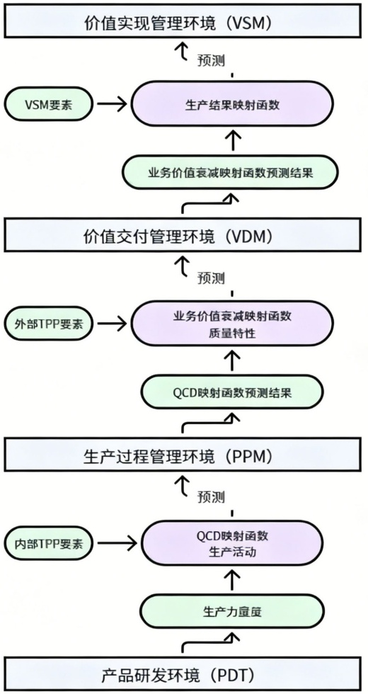

