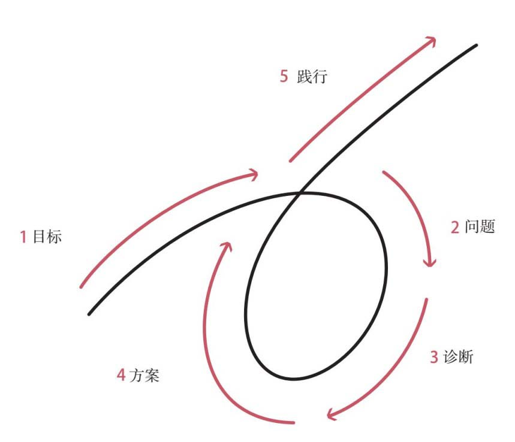

# 原则

## 作品分类(Category)

完整中文书籍。依据包括作者与 EPUB 转换信息、连续的导言、三大部分、结语、附录、参考文献和版权页。原始文件包含 53 幅有效图片引用。

## 主题摘要(Summary)

瑞·达利欧把原则定义为能够反复应用于相似情境、构成行动基础的根本性真理。全书以他的个人经历为证据起点：投资失误、桥水的发展和组织管理难题不断暴露错误，由此形成“经历—痛苦—反思—原则—改进行动”的学习循环。

生活原则把这一循环整理为拥抱现实、五步流程、头脑极度开放、理解个体差异和系统化决策。工作原则进一步将其应用于组织，把机构视为由文化和人构成的机器，主张通过极度求真、极度透明、深思熟虑的意见分歧和可信度加权决策形成创意择优。

作者并不要求读者照搬桥水模式，而是要求独立判断、检验原则、记录例外并持续修订。全书最终指向一种实践方法：把经验转化为明确规则，再借助反馈、工具和他人的互补能力提高行动质量。

## 关键主张(Key Claims)

1. 原则让人不必把每个遭遇当成孤立事件，而能识别“类似情境的再现”并做出更稳定的决策。作者的原文定义是：“原则是根本性的真理，它构成了行动的基础。”（导言，第 67–69 行）
2. 失败只有经过反思才会产生进步；“痛苦+反思=进步”是作者个人进化机制的压缩表达。（第二部分第 1 条，第 1399–1407 行）
3. 实现愿望可以分解为目标、问题、诊断、方案、践行五个有顺序的步骤，并通过反馈反复运行。（第二部分第 2 条，第 1567–1588 行）
4. 自我防卫和思维盲点会妨碍理解事实；头脑极度开放与深思熟虑的意见分歧能利用他人的视角改善决策。（第二部分第 3 条，第 1705–1785 行）
5. 作者认为组织是由文化和人构成的机器，并提出“创意择优=极度求真+极度透明+可信度加权的决策”。（第三部分，第 3604–3618、3678–3694 行）

## 书籍结构(Structures)

1. [[principles-part-one-my-journey(原则·第一部分：我的历程)]]：以 1949—2017 年的经历说明原则如何从错误、市场事件和桥水实践中形成。
2. [[principles-part-two-life-principles(原则·第二部分：生活原则)]]：建立个人进化、五步流程、开放思维、个体差异和有效决策框架。
3. [[principles-part-three-work-principles(原则·第三部分：工作原则)]]：把生活原则应用于文化、人员、组织机器和治理。
4. 附录：介绍桥水用于把原则嵌入行为的教练、集点器、棒球卡、问题日志、痛苦按钮和分歧解决器等工具。

### 重要图示

- 目标—失败—学习原则—提高循环：`raw/原则_images/images/00003.jpeg`。
- 五步流程循环：`raw/原则_images/images/00022.jpeg`。
- 认知能力与谦逊／头脑开放坐标：`raw/原则_images/images/00023.jpeg`。
- “思考→原则→算法→好决策”：`raw/原则_images/images/00035.jpeg`。

## 目录与实际结构的差异

形式目录分为自传、生活原则和工作原则三部分；实际论证是“经验来源→个人方法→组织应用”。第一部分不是独立传记目的，而是为原则提供形成背景。第二部分在正文后另有概要列表；第三部分先给出完整原则列表，再展开三个宏观模块，因此存在有意重复。附录则把抽象原则进一步落实为工具和行为准则。

## 提及的实体(Entities Mentioned)

- [[ray-dalio(瑞·达利欧)]]
- [[bridgewater-associates(桥水)]]

文斯·隆巴尔迪、王岐山、美联储及书中其他人物和组织主要作为案例或历史背景，本次不单独建页。

## 相关概念(Concepts)

- [[principles(原则)]]
- [[personal-evolution(个人进化)]]
- [[pain-reflection-loop(痛苦—反思循环)]]
- [[five-step-process(五步流程)]]
- [[radical-open-mindedness(头脑极度开放)]]
- [[thoughtful-disagreement(深思熟虑的意见分歧)]]
- [[believability-weighted-decision-making(可信度加权决策)]]
- [[expected-value-decision-making(预期价值决策)]]
- [[systematic-decision-making(系统化决策)]]
- [[idea-meritocracy(创意择优)]]
- [[radical-truth(极度求真)]]
- [[radical-transparency(极度透明)]]
- [[machine-model(机器模型)]]
- [[people-role-fit(人岗匹配)]]
- [[tough-love(严厉之爱)]]
- [[meaningful-work(有意义的工作)]]
- [[meaningful-relationships(有意义的人际关系)]]

## 重要引文(Notable Quotes)

> “原则是根本性的真理，它构成了行动的基础。”——导言，第 67 行

> “痛苦+反思=进步。”——生活原则，第 1399 行

> “你是在寻找最好的答案，而不是你自己能得出的最好答案。”——生活原则，第 1761 行

> “创意择优=极度求真+极度透明+可信度加权的决策。”——工作原则，第 3694 行

## 局限／偏见(Limitations / Bias)

- 证据主要来自作者的个人经历和桥水实践，组织绩效与管理方法之间的因果关系没有在本书中得到独立验证。
- 人格测试、神经科学和人工智能部分包含作者的实践性解释，适合视为待其他来源检验的单一来源主张。
- 桥水文化要求高度透明、持续评价和高标准，并不适合所有人或所有组织；作者也明确承认原则存在例外且需按情境调整。
- 第一部分大量使用成功后的回顾性解释，可能受到幸存者偏差和作者视角限制。
